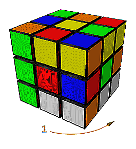

# Jupyter-Puzzles
Ce dépôt contient des notebooks jupyter (fichiers d'extension `ipynb`), avec noyau python ou sage, ayant pour objet la résolution de puzzles, de problèmes logiques, etc.   
Si vous clonez tout ou partie du dépôt, veillez à respecter l'arborescence des fichiers.

## 1 Python

### Utilisation d'un noteboook jupyter `xxx.ipynb` avec un noyau [Python](https://www.python.org/)

- Si [Python](https://www.python.org), avec [jupyter](https://jupyter.org/install), est installé sur votre machine, utiliser la commande `jupyter notebook` dans un répertoire qui contient `xxx.ipynb` ou ouvrir le fichier dans [VScode](https://code.visualstudio.com/) ;
- sinon, avec un compte Google, le plus simple est de téléverser les fichiers dans un sous répertoire de `Mon Drive/Colab Notebooks/` dans `Google Drive` et d'ouvrir `Mon Drive/Colab Notebooks/.../xxx.ipynb` dans un navigateur (partir de [Mon Drive](https://drive.google.com/drive/my-drive)). Noter que cela permet aussi de faire fonctionner Python sur un smartphone.  

### 1.1 Permutations ([`permutations.pynb`](./python/permutations/permutations.ipynb))

Génération de toutes les permutations d'un ensemble (fini) par un joli algorithme et application à des petites énigmes.

### 1.2 Parcours de graphe ([`parcours.ipynb`](./python/outils/parcours.ipynb)) 
Fournit trois fonctions python utilisées par d'autres notebooks
- `dfs` parcours en profondeur, utilisé par [`solitaire.ipynb`](./python/solitaire/solitaire.ipynb)
- `bfs` parcours en largeur
- `aStar` algorithme A*, utilisé par  [`sokoban.ipynb`](./python/sokoban/sokoban.ipynb) et [`8-puzzle.ipynb`](./python/8-puzzle/8-puzzle.ipynb)

### 1.3 [Solitaire](https://fr.wikipedia.org/wiki/Solitaire_(casse-t%C3%AAte)) ([`solitaire.ipynb`](./python/solitaire/solitaire.ipynb)) 

Utilisation du [parcours en profondeur](./python/outils/parcours.ipynb) d'un graphe pour la résolution de solitaires, par exemple anglais, français ou allemand :

 &nbsp;&nbsp;&nbsp;&nbsp;&nbsp;&nbsp;&nbsp;&nbsp;  &nbsp;&nbsp;&nbsp;&nbsp;&nbsp;&nbsp;&nbsp;&nbsp;  

### 1.4 [Sokoban](https://fr.wikipedia.org/wiki/Sokoban) ([`sokoban.ipynb`](./python/sokoban/sokoban.ipynb) 

Utilisation de l'[Algorithme A*](./python/outils/parcours.ipynb) pour trouver une solution optimale (nombre minimum de déplacements) d'un sokoban de pas trop grande dimension, par exemple, le microcosmos31 :

### 1.5 8-puzzle ([`8-puzzle.ipynb`](./python/8-puzzle/8-puzzle.ipynb))

Utilisation de l'[Algorithme A*](./python/outils/parcours.ipynb) pour trouver une solution optimale (nombre minimum de déplacements) d'une version simplifiée (8 pièces au lieu de 15) du [15-puzzle](https://fr.wikipedia.org/wiki/Taquin)

### 1.6 [Marche du cavalier](https://fr.wikipedia.org/wiki/Probl%C3%A8me_du_cavalier) ([`cavalier.ipynb`](./python/cavalier/cavalier.ipynb))
Application de la notion de cycle hamiltonien d'un graphe à la résolution du problème du cavalier :

### 1.7 [Automates](https://fr.wikipedia.org/wiki/Th%C3%A9orie_des_automates) ([`automates.ipynb`](./python/automates/automates.ipynb))
Applications de la théorie des automates à la résolution de problèmes [de bouteilles](https://www.prise2tete.fr/forum/viewtopic.php?id=5151) et de [de passage de rivière](https://fr.wikipedia.org/wiki/Probl%C3%A8mes_de_passage_de_rivi%C3%A8re), ainsi que de l'énigme dite des 4 jetons ou du barman aveugle.

### 1.8 Deux problèmes de logique ([`logique.ipynb`](./python/logique/logique.ipynb))
choisis parmi les plus beaux (selon moi) problèmes du type "je sais, je sais pas" : le problème de Freudenthal et le problème de Axel Born, Kor Hurkens et Gerhard Woeginger, tous deux référencés [ici](https://interstices.info/jcms/c_33649/l-incroyable-probleme-de-freudenthal).

### 1.9 [Mastermind](https://fr.wikipedia.org/wiki/Mastermind) ([`mastermind.ipynb`](./python/mastermind/mastermind.ipynb))
Faire jouer à l'ordinateur le rôle du décodeur dans le jeu Mastermind. L'algorithme utilisé, dû à [Donald Knuth](https://fr.wikipedia.org/wiki/Donald_Knuth), est nommé *five-guess* car il permet, dans le cas du mastermind classique ($4$ positions et $6$ couleurs), de trouver le code caché en au plus cinq propositions (cinq motifs proposés).  
Une autre méthode (D. L. Greenwell) est proposée qui consiste à toujours proposer les 6 motifs suivants (dans 89 % des cas, les 5 premiers suffisent) :

### 1.10 [Rubik's Cube 2x2x2](https://fr.wikipedia.org/wiki/Pocket_Cube) ([`rubikcube2x2x2.ipynb`](./python/rubikcube/rubikcube2x2x2.ipynb))
Utilisation de la notion de parcours en largeur d'un graphe pour calculer efficacement une solution optimale d'un Rubik's Cube 2x2x2.

Pour être complet, le notebook comprend aussi une interface avec l'excellent [solveur](https://github.com/Wiston999/python-rubik) de Victor Cabezas qui calcule en un temps très raisonable une solution presque optimale d'un Rubik's Cube classique 3x3x3. Pour l'utiliser : `pip install rubik_solver`

### 1.11 [Snake Cube](https://fr.wikipedia.org/wiki/Cube_serpent) ([`snakecube.ipynb`](./python/snakecube/snakecube.ipynb)) 
Calcul des solutions d'un cube serpent :

 &nbsp;&nbsp;&nbsp;&nbsp;&nbsp;&nbsp;&nbsp;&nbsp; 

### 1.12 Fonction de Grundy et noyau d'un graphe acyclique ([`noyau-graphe.ipynb`](./python/noyau/noyau-graphe.ipynb))

Application à quelques [jeux impartiaux](https://fr.wikipedia.org/wiki/Jeu_impartial) sans partie nulle.

## 2 Programmation par contraintes avec Python

[Programmation par contraintes, Louis-Martin Rousseau et Gilles Pesant](https://www.tofgarion.net/lectures/XX201/choco/PPC.pdf) constitue une bonne introduction aux algorithmes utilisés en PPC (Programmation Par Contraintes) par les solveurs disponibles dans Python, comme [OR-Tools](https://developers.google.com/optimization/introduction/python?hl=fr), le solveur de Google .

### 2.1 [Le problème SAT](https://fr.wikipedia.org/wiki/Probl%C3%A8me_SAT) ([`SAT.ipynb`](./python/programmationContraintes/SAT/SAT.ipynb))

Implémentation de [l'algorithme de Davis–Putnam–Logemann–Loveland (DPLL)](https://fr.wikipedia.org/wiki/Algorithme_DPLL) de résolution du problème de satisfiabilité d'une [FNC](https://fr.wikipedia.org/wiki/Calcul_des_propositions#Formes_normales_conjonctives,_formes_normales_disjonctives).

On applique SAT à la résolution de petits problèmes de PPC comme la résolution du [problème du zèbre](https://fr.wikipedia.org/wiki/Int%C3%A9gramme), de [sudokus](https://fr.wikipedia.org/wiki/Sudoku) et du [problème des 8 reines](https://fr.wikipedia.org/wiki/Probl%C3%A8me_des_huit_dames).

### 2.2 Utilisation de [cpmpy](https://cpmpy.readthedocs.io/en/latest/modeling.html)

Voir la [documentation](https://cpmpy.readthedocs.io/en/latest/modeling.html) ; en voici un très court [résumé](./python/programmationContraintes/cpmpy/cpmpy.pdf).

### Exemples ([`cpmpy-exemples.ipynb`](./python/programmationContraintes/cpmpy/exemples/cpmpy-exemples.ipynb))

5 exemples d'applications du module CPMpy dont

[Application de la théorie des graphes à la criminologie](https://omnilogie.fr/O/Qui_a_tu%C3%A9_le_duc_de_Densmore_?)

Marche du fou :

### 2.3 [Génération d'explications pour la résolution de problèmes de satisfaction de contraintes](https://arxiv.org/pdf/2006.06343.pdf) ([`explications.ipynb`](./python/programmationContraintes/cpmpy/explications/explications.ipynb))

Notebook dont l'essentiel est issu de  [la page `github` de cpmy](https://github.com/CPMpy/cpmpy).

A lire en parallèle avec l'un des trois notebooks suivants :

### [Le problème du zèbre](https://fr.wikipedia.org/wiki/Int%C3%A9gramme) ([`zebre.ipynb`](./python/programmationContraintes/cpmpy/explications/zebre/zebre.ipynb))

Génération d'une suite d'[explications pas à pas](./python/programmationContraintes/cpmpy/explications/zebre/zebre.png) pour la résolution du problème du zèbre.

### [Sudoku](https://fr.wikipedia.org/wiki/Sudoku) ([`sudoku.ipynb`](./python/programmationContraintes/cpmpy/explications/sudoku/sudoku.ipynb))

Production d'une suite d'images expliquant la résolution case après case d'une grille de sudoku :

 

### Démineur ([`demineur.ipynb`](./python/programmationContraintes/cpmpy/explications/demineur/demineur.ipynb))

Il s'agit du [Puzzle Démineur](https://www.janko.at/Raetsel/Minesweeper) et pas du jeu vidéo.

Production d'une suite d'images expliquant la résolution case après case  d'une grille de démineur : 

## 3 Sage

### 3.1 Utilisation d'un noteboook jupyter `xxx.ipynb` avec un noyau [SageMath](https://www.sagemath.org/)

- si SageMath est installé sur votre machine, utiliser la commande `sage -n jupyter` dans un répertoire qui contient `xxx.ipynb` ou ouvrir le fichier dans [VScode](https://code.visualstudio.com/) ; 
- ou vous pouvez ouvrir un compte [`sage.syzygy.ca`](https://sage.syzygy.ca/) ou [cocalc](https://cocalc.com/).

### 3.2 Rubik's Cube 3x3x3 ([`rubikcube.ipynb`](./sage/rubikcube/rubikcube.ipynb))
Interface avec les solveurs de Rubik's Cube fournis par Sage (si le package externe [`rubiks`](https://doc.sagemath.org/html/en/reference/spkg/rubiks.html) est installé [^1]) et affichage graphique  des solutions:

### 3.3 [Rubik's Snake](https://fr.wikipedia.org/wiki/Rubik%27s_Snake) ([`rubiksnake.ipynb`](./sage/rubiksnake/rubiksnake.ipynb))
Etude d'un Rubik's Snake donné par son code, par exemple [000000220220220102202200](https://raw.githack.com/YvesLemaire/images/main/cat.html) et
[aide à sa réalisation](./sage/rubiksnake/cat.png) :

### 3.4 [Problème de la couverture exacte](https://fr.wikipedia.org/wiki/Algorithme_X_de_Knuth) ([`algorithmeX.ipynb`](./sage/couvertureExacte/algorithmeX.ipynb))
L'algorithme X de Knuth est implémenté efficacement avec la méthode, incluse dans Sage, des [liens dansants](https://arxiv.org/pdf/cs/0011047.pdf) de [Donald Knuth](https://www-cs-faculty.stanford.edu/~knuth/).

#### [`tests.ipynb`](./sage/couvertureExacte/tests.ipynb)
Résolution de [sudokus](https://fr.wikipedia.org/wiki/Sudoku) et du [problème des 8 reines](https://fr.wikipedia.org/wiki/Probl%C3%A8me_des_huit_dames) 
#### [`puzzles-carres.ipynb`](./sage/couvertureExacte/puzzles-2D/puzzles-carres/puzzles-carres.ipynb)
Puzzles de polyominos : 

#### [`puzzles-hexagones.ipynb`](./sage/couvertureExacte/puzzles-2D/puzzles-hexagones/puzzles-hexagones.ipynb)
Puzzles de polyhexs : 

#### [`puzzles-triangles.ipynb`](./sage/couvertureExacte/puzzles-2D/puzzles-triangles/puzzles-triangles.ipynb)
Puzzles de polyiamonds : 

#### [`puzzles-3D.ipynb`](./sage/couvertureExacte/puzzles-3D/puzzles-3D.ipynb)
[Puzzles de polycubes](https://raw.githack.com/YvesLemaire/images/main/graphic-0.html) :

  

[^1]: `rubiks` est pré-installé sur  [`sage.syzygy.ca`](https://sage.syzygy.ca/) et [cocalc](https://cocalc.com/)
